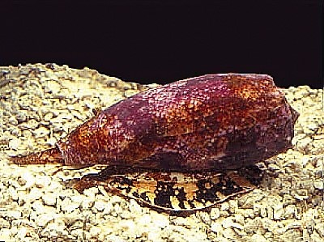

PowerConeSnail
====

This is Powershell Injection Framework for Excel VBA.

## Description

You can injection your powershell script into your xlsm file easily.
The creature from which this repository name was derived is [Conus geographicus](https://www.wikiwand.com/en/Cone_snail).

## VS. [xlwings](https://www.xlwings.org/)

If your work environment is full of Linux and Unix, xlwings may be a better option. That may not be the case with Windows.

## Requirement

- Powershell 7 or Later
- Excel 2007 or Later
- Windows 7 or Later

## Usage

1. Write your code in `src/main.ps1`.
1. First run `build-module.ps1`.
1. Then generated `src/Classes/PayloadCreater.vb`.
1. Next run `write-vba.ps1`.

## Contribution

Always welcome.

## Licence

MIT

## Author

[@ShortArrow](https://github.com/ShortArrow)